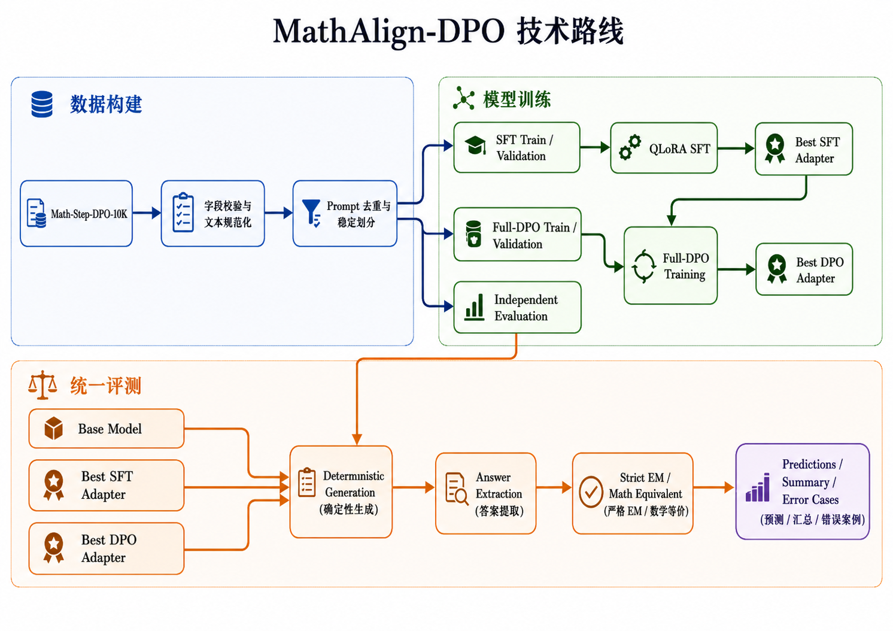
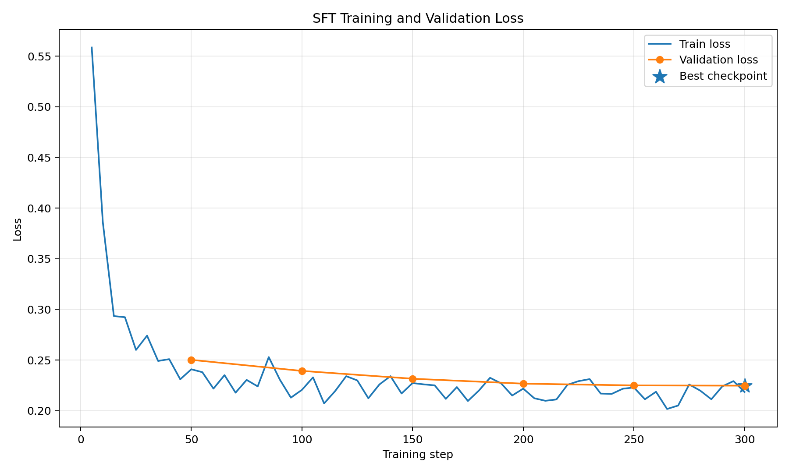
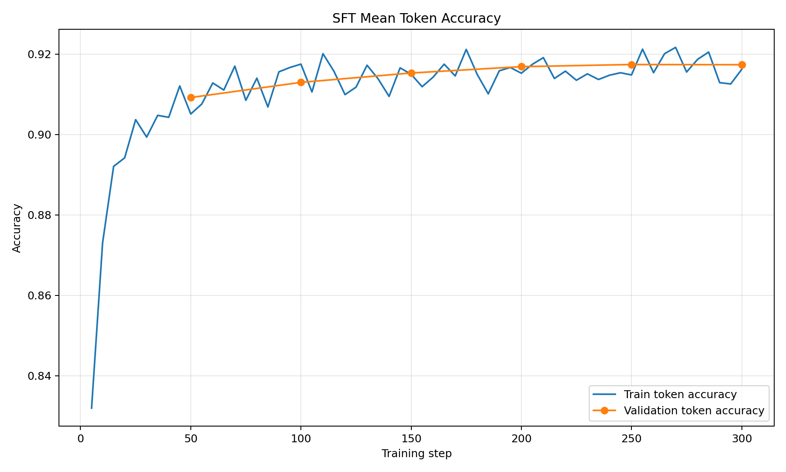
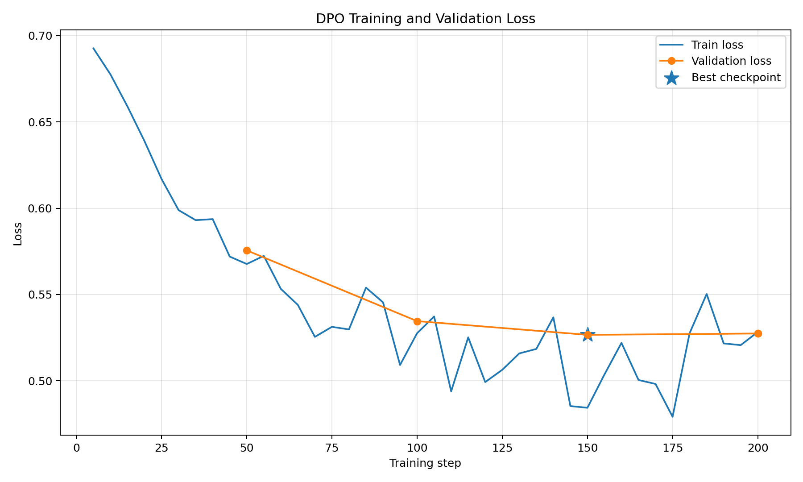
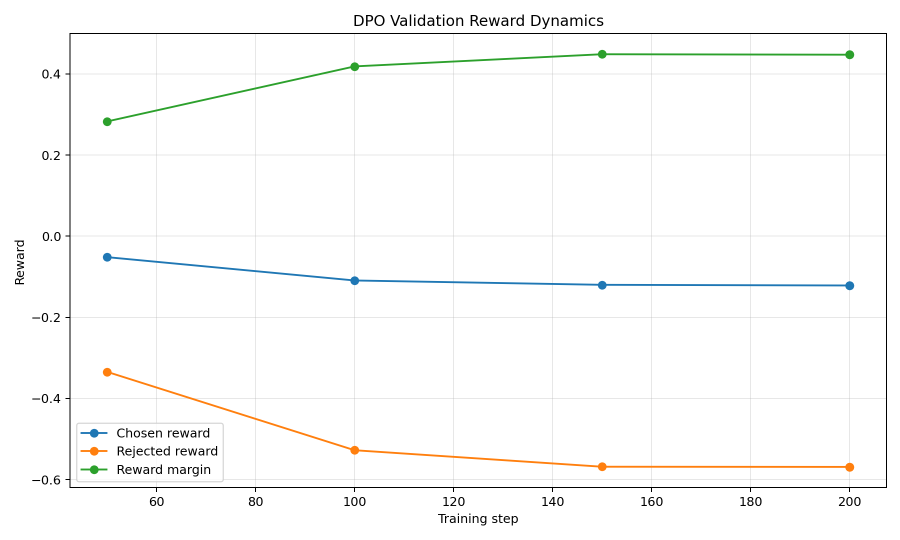
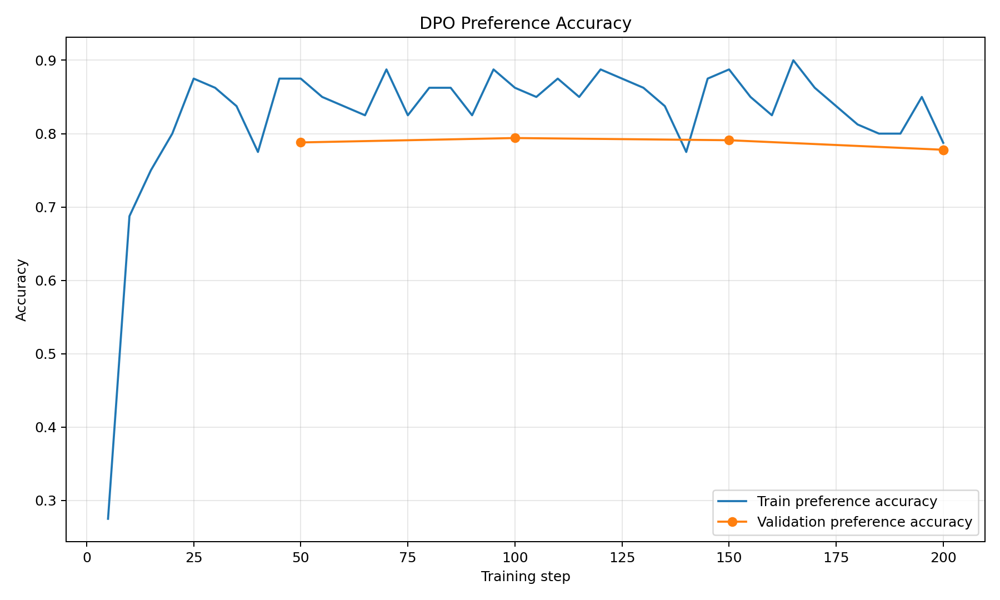

# MathAlign-DPO

> 基于 Qwen2.5-3B-Instruct 的数学推理后训练项目：在单张 RTX 4090 24GB 上完成统一数据构建、QLoRA SFT、Full-DPO、最优 Checkpoint 选择和 1,000 题自动化评测。

<p>
  
  
  
  
  
</p>

## 1. 项目简介

MathAlign-DPO 面向数学推理场景，围绕 **监督微调（SFT）—偏好优化（DPO）—生成式评测** 构建完整后训练闭环。

项目统一使用 `xinlai/Math-Step-DPO-10K`，从同一批数学问题生成：

- SFT 正向推理数据；
- Full-DPO 完整轨迹偏好数据；
- 与训练集隔离的最终 Evaluation 数据。

本项目重点解决的不只是“让训练脚本运行起来”，还包括数据去重、长度过滤、答案提取、数学等价判断、最优 Adapter 选择、训练曲线审计和 Base/SFT/DPO 公平对比。

---

## 2. 项目亮点

- **统一数据链路**：同一数据源生成 SFT、DPO 和 Evaluation，减少跨数据集分布偏移。
- **题目级隔离**：按规范化 Prompt 生成稳定 ID，避免同一道题跨 Train、Validation 和 Evaluation。
- **完整轨迹 SFT**：将公共正确前缀和正确后续解答拼接为完整监督目标。
- **完整轨迹 DPO**：在相同题目和公共前缀下比较正确轨迹与错误轨迹。
- **单卡可复现**：基于 QLoRA、NF4 和 BF16，在 RTX 4090 24GB 上完成 3B 模型训练。
- **自动选择最优权重**：依据 Validation Loss 保存并加载 Best Adapter。
- **统一生成评测**：使用相同 Prompt、Tokenizer 和确定性生成参数比较 Base、SFT、DPO。
- **数学答案评测**：支持最终答案提取、标准化、Strict Exact Match 和 Math Equivalent。
- **训练过程可审计**：保存 Loss、Token Accuracy、Reward Margin、Preference Accuracy 和运行配置。

---

## 3. 技术路线

---

## 4. 数据构建

### 4.1 数据来源

```text
Dataset: xinlai/Math-Step-DPO-10K
Base model: Qwen/Qwen2.5-3B-Instruct
```

使用的核心字段：

```text
prompt
initial_reason_steps
full_chosen
full_rejected
answer
```

### 4.2 SFT 数据

输入：

```text
原始数学问题

Let's think step by step.
```

监督目标：

```text
initial_reason_steps + full_chosen
```

即：

```python
full_positive = concat_reasoning(
    initial_reason_steps,
    full_chosen,
)
```

### 4.3 Full-DPO 数据

Prompt：

```text
原始数学问题

Let's think step by step.
```

Chosen：

```text
initial_reason_steps + full_chosen
```

Rejected：

```text
initial_reason_steps + full_rejected
```

Chosen 和 Rejected 共享同一个正确推理前缀，在后续轨迹上形成偏好差异。

### 4.4 Evaluation 数据

Evaluation 只向模型提供：

```text
prompt + "Let's think step by step."
```

参考标签仅保存最终答案。以下字段不会进入模型输入：

```text
initial_reason_steps
full_chosen
full_rejected
chosen
rejected
```

### 4.5 实际数据规模

经过字段校验、Prompt 去重和 Tokenizer 长度过滤后，本轮正式实验使用：

| 用途 | Train | Validation | Evaluation |
|---|---:|---:|---:|
| SFT | 6,887 | 1,000 | — |
| Full-DPO | 6,887 | 1,000 | — |
| 最终评测 | — | — | 1,000 |

项目保留数据质量和上下文长度约束，不使用重复样本强行补足训练数量。

---

## 5. 模型与训练配置

| 项目 | 配置 |
|---|---|
| Base Model | Qwen2.5-3B-Instruct |
| GPU | NVIDIA GeForce RTX 4090 D 24GB |
| Precision | BF16 |
| Quantization | 4-bit NF4 |
| Parameter-efficient training | LoRA / QLoRA |
| LoRA Rank | 16 |
| LoRA Alpha | 32 |
| LoRA Dropout | 0.05 |
| Max Sequence Length | 1024 |
| SFT Max Steps | 300 |
| SFT Learning Rate | 2e-4 |
| DPO Max Steps | 200 |
| DPO Learning Rate | 5e-6 |
| DPO Beta | 0.1 |
| Optimizer | Paged AdamW 8-bit |
| LR Scheduler | Cosine |
| Effective Batch Size | 16 |

DPO 从 SFT Adapter 开始训练，而不是直接从 Base Model 开始。

---

## 6. 训练曲线分析


### 6.1 SFT Loss



SFT 在前 50 Steps 内快速收敛，训练 Loss 从 `0.5585` 降至约 `0.24`。随后 Loss 在较低区间内波动，Validation Loss 持续缓慢下降：

```text
Step 50:  0.2502
Step 100: 0.2393
Step 150: 0.2316
Step 200: 0.2267
Step 250: 0.2250
Step 300: 0.2247
```

最优 SFT Checkpoint：

```text
Best Step: 300
Best Validation Loss: 0.2247
```

训练过程中未出现 NaN、Inf 或梯度爆炸，说明 QLoRA SFT 数值稳定。

### 6.2 SFT Token Accuracy



Validation Mean Token Accuracy 从 `0.9092` 提升至 `0.9173`。该指标说明模型对监督轨迹的 Token-level 拟合能力不断提高。

需要注意：

> Token Accuracy 和 Validation Loss 反映的是对训练分布及参考轨迹的拟合程度，不等同于未见数学题上的最终答案正确率。

因此，本项目始终使用独立生成式 Evaluation 作为最终能力指标。

### 6.3 DPO Loss



DPO 初始训练 Loss 接近随机偏好基线：

```text
Initial Loss: 0.6926
```

随着训练推进，Train Loss 整体下降并伴随正常 Batch 波动。Validation Loss 的变化为：

```text
Step 50:  0.5756
Step 100: 0.5346
Step 150: 0.5267
Step 200: 0.5274
```

最优 DPO Checkpoint：

```text
Best Step: 150
Best Validation Loss: 0.5267
```

Step 150 后 Validation Loss 不再继续下降，因此正式 Evaluation 使用 Step 150 的 Best Adapter，而不是最后一个 Checkpoint。

### 6.4 DPO Reward Dynamics



Validation Reward Margin 从 `0.2828` 增长至约 `0.4484`，说明模型逐步拉开了 Chosen 与 Rejected 的偏好间隔。

从曲线可以观察到：

- Chosen Reward 仅小幅下降；
- Rejected Reward 下降更明显；
- Reward Margin 持续扩大后趋于稳定。

这说明当前 Full-DPO 主要通过**降低错误轨迹的相对概率**建立偏好，而不是显著抬高正确轨迹概率。

### 6.5 DPO Preference Accuracy



Validation Preference Accuracy 在训练后稳定在约 `78%～79%`：

```text
Step 50:  78.8%
Step 100: 79.4%
Step 150: 79.1%
Step 200: 77.8%
```

该结果说明模型已经学会区分大部分 Chosen/Rejected Pair，但 Step 150 后继续训练没有带来更好的 Validation 表现，与 Best Checkpoint 的选择一致。

---

## 7. 效果

| 模型 | Strict Exact Match | Math Equivalent |
|---|---:|---:|
| Base | 64.6% | 65.2% |
| SFT | 69.9% | 70.3% |
| Full-DPO | 72.1% | 72.9% |

---

## 8. 统一评测

所有模型使用相同的确定性生成设置：

```yaml
samples: 1000
batch_size: 32
max_new_tokens: 1024
do_sample: false
temperature: 0.0
top_p: 1.0
num_beams: 1
```

评测模型：

```text
Base
SFT Best Adapter
DPO Best Adapter
```

核心指标：

- Strict Exact Match；
- Math Equivalent；
- Answer Extraction Rate；
- EOS Finish Rate；
- Length Truncation Rate；
- Average Output Tokens；
- Average Generation Time。

评测产物：

```text
outputs/results/formal/
├── base_sft_dpo_predictions.jsonl
├── base_sft_dpo_summary.json
├── correct_cases.jsonl
├── error_cases.jsonl
└── run_config.json
```

---

## 9. 项目结构

```text
MathAlign-DPO/
├── configs/
│   ├── qwen25_0_5b_m5_24gb_mini.yaml
│   └── qwen25_3b_4090.yaml
│
├── scripts/
│   ├── prepare_data.py
│   ├── train_sft.py
│   ├── train_dpo.py
│   └── evaluate_math.py
│
├── src/
│   └── mathalign_dpo/
│       ├── config/
│       ├── data/
│       ├── training/
│       └── evaluation/
│
├── data/
│   └── Math-10K/
│       ├── formal/
│       │   ├── sft/
│       │   ├── dpo/
│       │   └── evaluation/
│       └── mini/
│
├── outputs/
│   ├── formal/
│   │   ├── sft/
│   │   └── dpo/
│   └── results/
│
├── assets/
│   ├── sft_loss_curve.png
│   ├── sft_token_accuracy.png
│   ├── dpo_loss_curve.png
│   ├── dpo_reward_dynamics.png
│   ├── dpo_preference_accuracy.png
│   └── projected_accuracy_targets.png
│
├── requirements.txt
├── AGENTS.md
└── README.md
```

---

## 10. 环境安装

```bash
conda create -n mathalign-dpo python=3.11 -y
conda activate mathalign-dpo

pip install -r requirements.txt
pip install -e .
```

---

## 11. 数据准备

正式 RTX 4090 数据：

```bash
python -m scripts.prepare_data \
  --config configs/qwen25_3b_4090.yaml
```

Mini 链路：

```bash
python -m scripts.prepare_data \
  --config configs/qwen25_0_5b_m5_24gb_mini.yaml
```

数据构建完成后需要确认：

```text
Train、Validation、Evaluation 的 normalized prompt 交集为 0
SFT 与 DPO 使用相同的 Train/Validation 题目划分
Evaluation 输入不包含推理过程和答案字段
Mini 是 Formal 的稳定子集
重复运行得到相同 ID 和 Split
```

---

## 12. SFT 训练

Smoke Test：

```bash
python -m scripts.train_sft \
  --config configs/qwen25_3b_4090.yaml \
  --smoke-test
```

正式训练：

```bash
python -m scripts.train_sft \
  --config configs/qwen25_3b_4090.yaml
```

输出：

```text
outputs/formal/sft/
├── adapter/
├── best_adapter/
├── tokenizer/
├── loss_history.jsonl
└── run_config.json
```

---

## 13. DPO 训练

Smoke Test：

```bash
python -m scripts.train_dpo \
  --config configs/qwen25_3b_4090.yaml \
  --smoke-test
```

正式训练：

```bash
python -m scripts.train_dpo \
  --config configs/qwen25_3b_4090.yaml
```

训练入口自动加载 SFT Adapter，并根据 Validation Loss 保存最佳 DPO Adapter。

输出：

```text
outputs/formal/dpo/
├── adapter/
├── best_adapter/
├── tokenizer/
├── loss_history.jsonl
└── run_config.json
```

---

## 14. Base / SFT / DPO 统一评测

```bash
python -m scripts.evaluate_math \
  --config configs/qwen25_3b_4090.yaml
```

评测阶段自动：

1. 加载 Base Model；
2. 加载 Best SFT Adapter；
3. 加载 Best DPO Adapter；
4. 使用相同的 Evaluation Prompt；
5. 执行确定性生成；
6. 提取并规范化最终答案；
7. 生成 Summary、Correct Cases 和 Error Cases。

---

## 15. 核心实验结论

1. **训练稳定性**：SFT 和 DPO 均正常收敛，没有数值异常或梯度爆炸。
2. **Checkpoint 选择有效**：SFT 最优点为 Step 300，DPO 最优点为 Step 150。
3. **偏好学习有效**：DPO Reward Margin 明显扩大，Validation Preference Accuracy 达到约 79%。
4. **错误轨迹抑制明显**：当前 Full-DPO 主要通过降低 Rejected 概率形成偏好间隔。
5. **评测链路完整**：项目已完成从生成、答案提取到数学等价判断的全流程。
6. **Token 指标与能力指标分离**：Loss 和 Token Accuracy 不能替代独立数学题生成评测。

---

## 16. 简历描述

> **MathAlign-DPO：基于 Qwen2.5-3B-Instruct 的数学推理后训练系统**

- 基于 Math-Step-DPO-10K 构建统一数据管线，完成题目级去重、确定性划分、Tokenizer 长度过滤，以及 SFT、Full-DPO 和独立 Evaluation 数据生成；
- 使用 Transformers、TRL、PEFT 和 BitsAndBytes，在单张 RTX 4090 24GB 上完成 QLoRA SFT 与 DPO 训练；
- 实现基于 Validation Loss 的最优 Adapter 自动保存与加载，SFT 最优 Step 为 300，DPO 最优 Step 为 150；
- 构建 Base/SFT/DPO 统一生成评测，支持答案提取、数学等价判断、EOS/截断统计和错误案例分析；
- 对训练过程中的 Loss、Token Accuracy、Reward Margin 和 Preference Accuracy 进行可视化与实验审计。

---

## 17. 技术栈

```text
Python
PyTorch
Transformers
Datasets
TRL
PEFT
BitsAndBytes
Accelerate
QLoRA
YAML
Matplotlib
```

---

## 18. License

本项目仅用于学习、研究与实验复现。数据集和基础模型的使用需遵循各自许可证。
